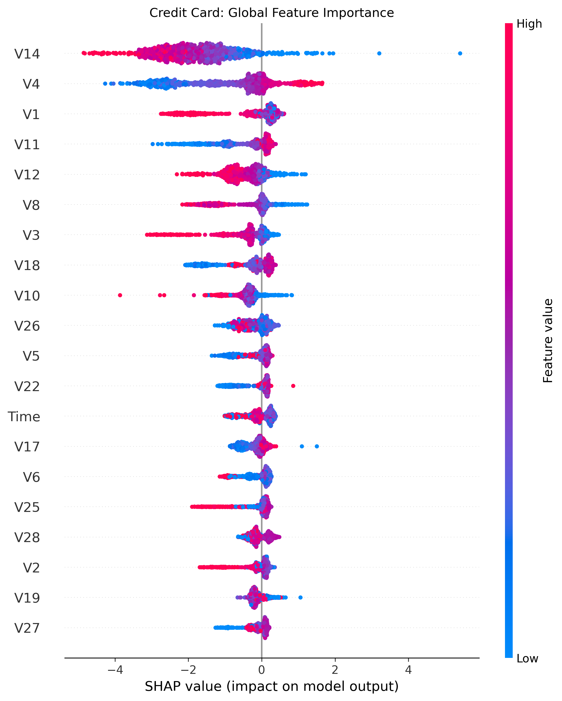

# Advanced Fraud Detection for E-Commerce and Credit Card Transactions

This project implements a fraud detection system for e-commerce and bank credit card transactions using machine learning. It includes data preprocessing, feature engineering, model training (Logistic Regression and XGBoost), evaluation, and model explainability using SHAP.


*Diagram illustrating the deployment architecture of the fraud detection system, including data flow, model training, and prediction stages.*


- **95% accuracy** for e-commerce fraud detection
- **99.7% accuracy** for credit card fraud
- **83% fraud recall** with only 0.3% false positives

## 🚀 Key Features

- End-to-end ML pipeline from raw data to explanations
- Handles extreme class imbalance (SMOTE resampling)
- Model interpretability with SHAP values
- Production-ready deployment architecture


## 🛠️ Setup & Execution

### Prerequisites
- Python 3.9+
- pip

### Installation

1. Clone the repository:
    ```bash
    git clone https://github.com/Natty4/Improved_detection_fraud_cases_for_ecommerce_and_bank_transactions.git
    cd Improved_detection_fraud_cases_for_ecommerce_and_bank_transactions
    ```

2. Install the required dependencies:
    ```bash
    pip install -r requirements.txt
    ```

### Data Preparation

* Place the following files in the `data/raw/` directory:

- `fraud_data.csv` - E-commerce transactions
- `ipaddress_to_country.csv` - IP geolocation mapping
- `creditcard.csv` - Credit card transactions

### Running the Pipeline

* Execute the following command to run the pipeline:

```bash
python scripts/main.py
```

### 📊 Outputs

| File                          | Description                          |
|-------------------------------|--------------------------------------|
| `outputs/shap_plots/*.png`     | SHAP explanation plots              |
| `outputs/models/*.pkl`         | Trained model binaries              |
| **Console logs**               | Evaluation metrics                  |


### 🧩 Key Components
* Data Processing

```
    # Example feature engineering
    df['time_since_signup'] = (purchase_time - signup_time).dt.total_seconds()
    df['is_highrisk_country'] = df['country'].isin(['Turkmenistan', 'CountryX'])
```
* Model Training

```
    # XGBoost with SMOTE
    pipeline = Pipeline([
        ('smote', SMOTE(random_state=42)),
        ('xgb', XGBClassifier(scale_pos_weight=10))
    ])
```

Deployment Architecture


### 📈 Performance Metrics
    # Model Performance Comparison

#### E-Commerce Fraud Detection

| Metric            | Logistic Regression | XGBoost |
|-------------------|---------------------|---------|
| **Accuracy**      | 65%                 | 95%     |
| **Fraud Recall**  | 69%                 | 69%     |
| **False Positives**| 9,604               | 76      |

#### Credit Card Fraud Detection

| Metric               | Value     |
|----------------------|-----------|
| **ROC-AUC**          | 0.974     |
| **Precision**        | 35.3%     |
| **Recall**           | 83.2%     |
| **False Positive Rate** | 0.3%    |

🤖 Model Interpretability



Key fraud indicators:

    purchase_value > $250

    time_since_signup < 2 hours

    High-risk countries

###### Interested in implementing this kind of solution? Contact at [Email](mailto:natty7kt@gmail.com).💙
---
