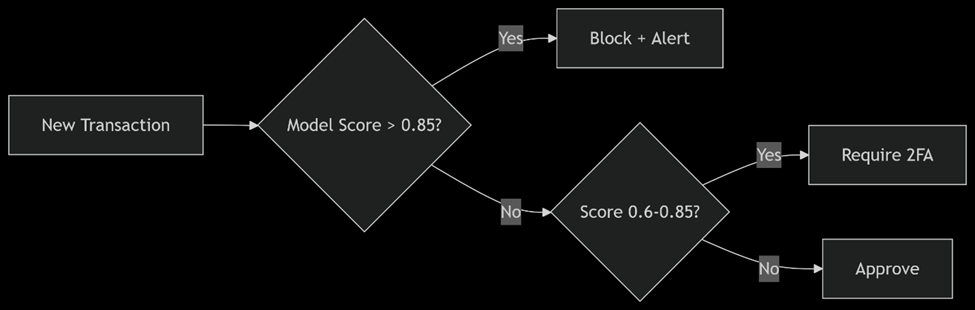

# Fraud Detection Project

This project implements a fraud detection system for e-commerce and bank credit card transactions using machine learning. It includes data preprocessing, feature engineering, model training (Logistic Regression and XGBoost), evaluation, and model explainability using SHAP.





- **95% accuracy** for e-commerce fraud detection
- **99.7% accuracy** for credit card fraud
- **83% fraud recall** with only 0.3% false positives

## 🚀 Key Features

- End-to-end ML pipeline from raw data to explanations
- Handles extreme class imbalance (SMOTE resampling)
- Model interpretability with SHAP values
- Production-ready deployment architecture

## 📂 Project Structure

fraud-detection/
├── config/ # Configuration files
├── data/ # Raw and processed data
│ ├── raw/ # Input datasets
│ └── processed/ # Processed features
├── outputs/ # Generated artifacts
│ ├── shap_plots/ # Explanation visualizations
│ └── models/ # Saved model binaries
├── src/ # Core Python modules
│ ├── core/ # Data processing
│ ├── models/ # ML training code
├── scripts/ # Execution scripts
└── tests/ # Unit tests
text


## 🛠️ Setup & Execution

### Prerequisites
- Python 3.9+
- pip

### Installation
```
git clone https://github.com/Natty4/Improved_detection_fraud_cases_for_ecommerce_and_bank_transactions.git
cd Improved_detection_fraud_cases_for_ecommerce_and_bank_transactions
pip install -r requirements.txt

Data Preparation

Place these files in data/raw/:

    fraud_data.csv - E-commerce transactions

    ipaddress_to_country.csv - IP geolocation mapping

    creditcard.csv - Credit card transactions

Running the Pipeline
```

python scripts/main.py

### 📊 Outputs
    File	Description
    outputs/shap_plots/*.png	SHAP explanation plots
    outputs/models/*.pkl	Trained model binaries
    Console logs	Evaluation metrics

### 🧩 Key Components
* Data Processing

```
    # Example feature engineering
    df['time_since_signup'] = (purchase_time - signup_time).dt.total_seconds()
    df['is_highrisk_country'] = df['country'].isin(['Turkmenistan', 'CountryX'])
```
* Model Training

```
    # XGBoost with SMOTE
    pipeline = Pipeline([
        ('smote', SMOTE(random_state=42)),
        ('xgb', XGBClassifier(scale_pos_weight=10))
    ])
```

Deployment Architecture


### 📈 Performance Metrics
    E-Commerce Fraud Detection
        Metric	Logistic Regression	XGBoost
        Accuracy	65%	95%
        Fraud Recall	69%	69%
        False Positives	9,604	76
    Credit Card Fraud Detection
        Metric	Value
        ROC-AUC	0.974
        Precision	35.3%
        Recall	83.2%
        False Positive Rate	0.3%
🤖 Model Interpretability

![shap_summary](outputs/shap_plots/ecom_shap_summary.png

Key fraud indicators:

    purchase_value > $250

    time_since_signup < 2 hours

    High-risk countries